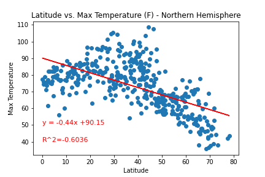
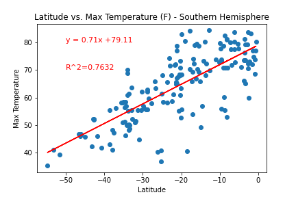
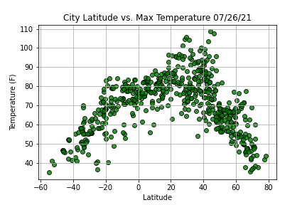
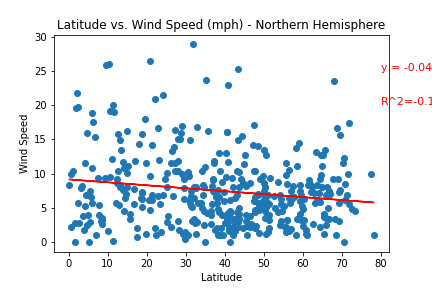
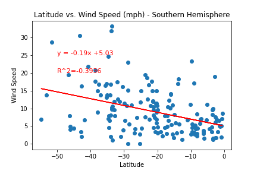

## Python API Challenge

### The temperature and the latitude have a different linear regression in the Northern Hemisphere and the Southern Hemisphere. For the Northern Hemisphere, the regression between latitude and temperature is negative, meaning that the greater the latitude, the temperature is going to be lower. However, the regression is positive in the southern hemisphere, showing that the temperature increases when the latitude increases.

---

### Related to the previous conclusion, in this plot, we can see the relationship between latitude and temperature, showing that cities that are located between -60 and -20 latitudes and between 40 and 80 latitudes have similar temperatures.

---

### Wind speed is one of the variables that is more related to latitude. Even though the regression is small, in the plots we can see that the they hava a negative regression, showing that everytime the lalitude decrease the wind speed also decrease. In the Southern Hemisohere graphic, the relationship is more remarkable but in the Northen Hemisphere.

